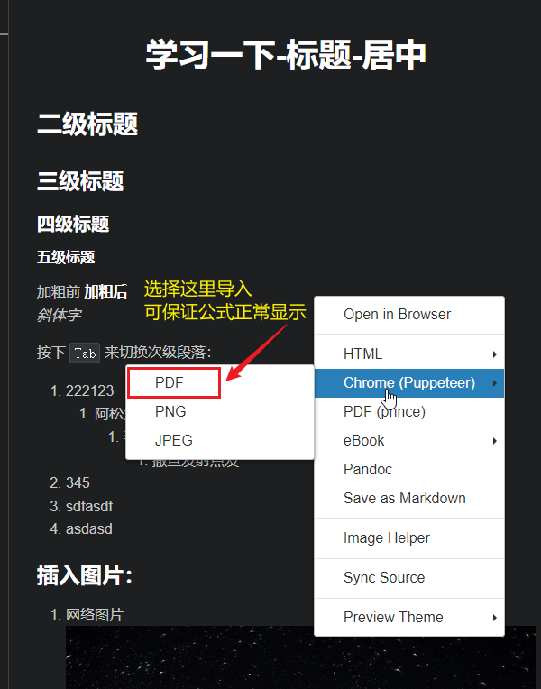

<h1 align = "center">学习一下-标题-居中</h1>

```html
Typora中，标题居中只能使用<div align = "center">这里输入要居中改的字体</div>，<center>这里输入要居中改的字体</center>对标题不起作用！！
```


## 二级标题
### 三级标题
#### 四级标题
##### 五级标题

加粗前 **加粗后**
*斜体字*


按下 <kbd>Tab</kbd> 来切换次级段落：

1. 222123
   1. 阿松大
      1. 手动阀手动阀
         1. 撒旦发射点发
2. 345
3. sdfasdf
4. asdasd

### 插入图片：
1. 网络图片

2. 本地图片


### 公式
$$
\alpha
$$

$$
(a + b)^2 = a^2 + 2ab + b^2
$$

$$
x^2 + y^2 = z^2
$$

$$
\lim_{x \to \infin}\frac{sin(t)}{x}=1
$$

### 表格

> 注意，下表中的左右两侧冒号： 代表对其方式，
> 其中 左边冒号 左对齐
> 右边冒号 右对齐
> 两侧冒号，居中
> 在编辑区中，选中表格，按 <kbd>Alt</kbd> + <kbd>Shift</kbd> + <kbd>F</kbd> 对编辑区文本进行格式化，方便观察

| 张三 | 李四  | 王五   |
| ---- | :---: | ------ |
| 22   |  21   | 33     |
| 阿萨 |  11   | 的功夫 |

### 插入链接
>先复制好链接地址，然后直接选中文本，按<kbd>Ctrl</kbd> + <kbd>v</kbd> 就直接生成视频超链接

这是教学[视频地址](https://www.bilibili.com/video/BV1si4y1472o?spm_id_from=333.337.search-card.all.click&vd_source=9bb0d817daa8d924c36805c0eacb5c31)


### 代码块
> 使用\```进入和退出代码块
> 在\```之后接语言种类，可以识别为指定语言
> \```java
> >...
> >代码
> >...
> >...
> 
> \```结束

```java
/**
 * 测试代码如下
 */

public class letsgotest{
    public static void main(String[] args) {
        //输出原数组中所有偶数
        int[] arr1 = new int[]{12, 23, 234, 2342, 22, 21, 5432, 32};
        for (int i = 0; i < arr1.length; i++) {
            if (arr1[i] % 2 == 0) {
                System.out.println(arr1[i] + "\t是 偶数，索引为：" + i);
                
            }
            else {
                System.out.println(arr1[i] + "\t是 奇数，索引为：" + i);
                
            }
        }
    }
}
```
---

>### 转PDF方法
>